# Scalable & Highly Available Web App Architecture on AWS

A production-style, three-tier web application architecture built on AWS — covering custom VPC network design, TLS-terminated load balancing, EC2 auto scaling, a Multi-AZ managed database, and proactive monitoring/alerting. Built entirely through the AWS Management Console to demonstrate hands-on, first-principles understanding of every component before automating it.

**Live demo:** https://redsparrowenterprise.in

---

## Table of Contents

- [Architecture](#architecture)
- [Tech Stack](#tech-stack--aws-services)
- [Key Design Decisions](#key-design-decisions)
- [Repository Structure](#repository-structure)
- [Build Walkthrough](#build-walkthrough)
- [Testing & Validation](#testing--validation)
- [Challenges & Fixes](#challenges--fixes)
- [Key Takeaways](#key-takeaways)
- [Security Notes](#security-notes)
- [Future Improvements](#future-improvements)
- [License](#license)

---

## Architecture

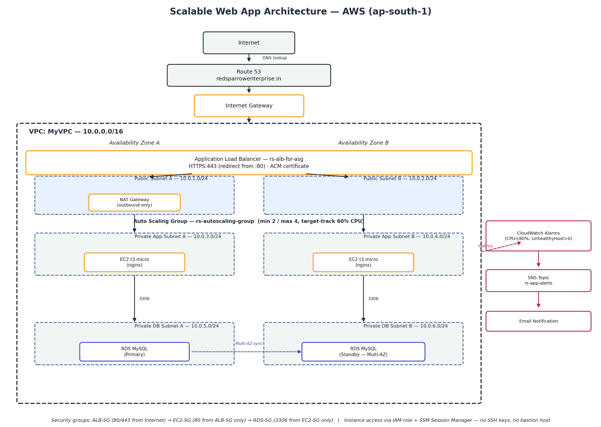

```
Internet
   |
Route 53 (redsparrowenterprise.in)
   |
Internet Gateway
   |
Public Subnet (2 AZs) — Application Load Balancer (HTTPS via ACM, HTTP→HTTPS redirect)
   |
Private App Subnet (2 AZs) — EC2 Auto Scaling Group (nginx, t3.micro, min 2 / max 4)
   |
Private DB Subnet (2 AZs) — RDS MySQL (Multi-AZ)
   |
CloudWatch Alarms → SNS → Email
```

## Tech Stack / AWS Services

| Service | Purpose |
|---|---|
| VPC | Custom network, 6 subnets across 2 AZs (public / app-private / db-private) |
| NAT Gateway | Outbound internet access for private-subnet instances |
| Application Load Balancer | HTTPS termination, HTTP→HTTPS redirect, health-checked routing |
| ACM | TLS certificate for the custom domain |
| EC2 Auto Scaling | nginx app servers, target-tracking scaling policy on CPU |
| RDS (MySQL) | Managed database, Multi-AZ, private subnet only |
| IAM | Least-privilege instance role (SSM access, no SSH keys or bastion host) |
| CloudWatch + SNS | Alarms for unhealthy hosts and high CPU, emailed via SNS |
| Route 53 | Custom domain routing to the ALB |

## Key Design Decisions

- **Private-subnet app & DB tiers** — only the load balancer is internet-facing; everything else is unreachable directly from the internet.
- **TLS terminates at the ALB** — internal ALB→EC2 traffic stays plain HTTP since it never leaves the VPC, avoiding unnecessary complexity of end-to-end encryption for this project.
- **No SSH, no bastion host** — instance access goes through AWS Systems Manager Session Manager, using an IAM role instead of open inbound ports or long-lived keys.
- **Target-tracking Auto Scaling** (60% CPU) instead of fixed capacity — the group scales 2→4 instances automatically under load and back down afterward.
- **Dedicated security group per tier** (ALB / EC2 / RDS), each only allowing traffic from the tier in front of it — no wide-open ports.

## Repository Structure

```
aws-scalable-web-app-architecture/
├── README.md                          # This file — full build narrative
├── LICENSE
├── diagrams/
│   └── architecture-diagram.png       # End-to-end architecture diagram
├── docs/
│   └── architecture-guide.md          # Detailed console build log with fixes
└── screenshots/
    ├── 01-vpc-subnets-igw.png
    ├── 02-private-route-table-nat.png
    ├── 03-security-groups-overview.png
    ├── 04-iam-role-ec2-app-role.png
    ├── 05-launch-template.png
    ├── 06-target-group-healthy-targets.png
    ├── 07-alb-resource-map.png
    ├── 08-route53-alias-record.png
    ├── 09-rds-configuration.png
    ├── 10-rds-security-group-rules.png
    ├── 11-autoscaling-group-details.png
    ├── 12-instances-launched-by-asg.png
    ├── 13-cloudwatch-alarm-cpu.png
    └── 14-https-live-verification.png
```

---

## Build Walkthrough

### 1. VPC & Subnet Design

Created a custom VPC (`10.0.0.0/16`) and split it into six subnets across two Availability Zones, separating the public, application, and database tiers:

| Subnet | Type | CIDR | AZ |
|---|---|---|---|
| Public-1 | Public | 10.0.1.0/24 | AZ1 |
| Public-2 | Public | 10.0.2.0/24 | AZ2 |
| Private-App-1 | Private | 10.0.3.0/24 | AZ1 |
| Private-App-2 | Private | 10.0.4.0/24 | AZ2 |
| Private-DB-1 | Private | 10.0.5.0/24 | AZ1 |
| Private-DB-2 | Private | 10.0.6.0/24 | AZ2 |

Separating App and DB into distinct private subnets is optional but a good habit — it keeps routing and NACLs tunable per tier as the project grows.

An **Internet Gateway** was attached to the VPC and routed from a public route table (`0.0.0.0/0 → IGW`), associated with both public subnets.

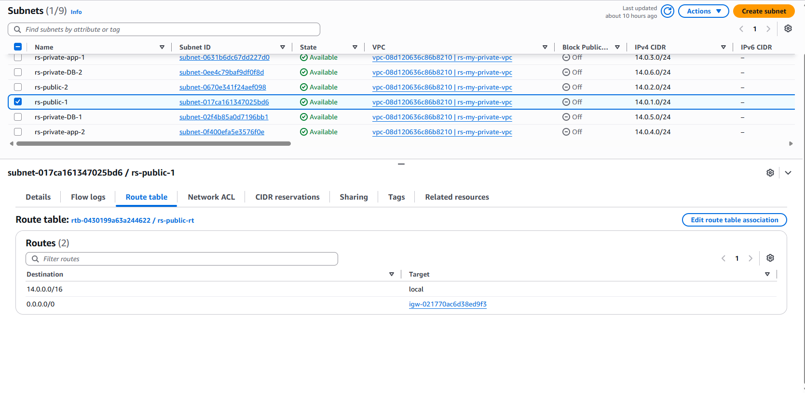

### 2. Outbound Connectivity for Private Subnets (NAT Gateway)

Private-subnet instances have no direct route to the internet by design, but they still need one to pull packages during boot. A NAT Gateway was provisioned in a public subnet with an Elastic IP, and a private route table (`0.0.0.0/0 → NAT Gateway`) was associated with all four private subnets.

> **Cost note:** NAT Gateway is not free-tier eligible — it bills hourly plus per-GB processed. One NAT Gateway is fine for a learning project; for production HA you'd deploy one per AZ so a single AZ outage can't take down the other AZ's outbound path.

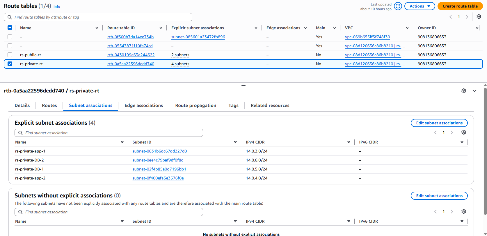

### 3. Security Groups (Tier-by-Tier)

Three dedicated security groups enforce that each tier only accepts traffic from the tier immediately in front of it:

- **ALB-SG** — inbound HTTP (80) and HTTPS (443) from `0.0.0.0/0`
- **EC2-SG** — inbound HTTP (80) from `ALB-SG` only
- **RDS-SG** — inbound MySQL (3306) from `EC2-SG` only

No security group allows direct inbound access from the internet to the application or database tiers.

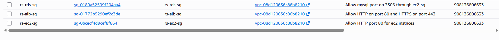

### 4. IAM Role for EC2 (SSM Access, No SSH)

Auto Scaling launches instances with no way to manage or monitor them unless a role is attached. Created `EC2-App-Role` with two AWS-managed policies:

- `AmazonSSMManagedInstanceCore` — enables connecting via **Session Manager** instead of SSH/bastion, so no inbound port needs to stay open
- `CloudWatchAgentServerPolicy` — lets the instance push custom metrics/logs

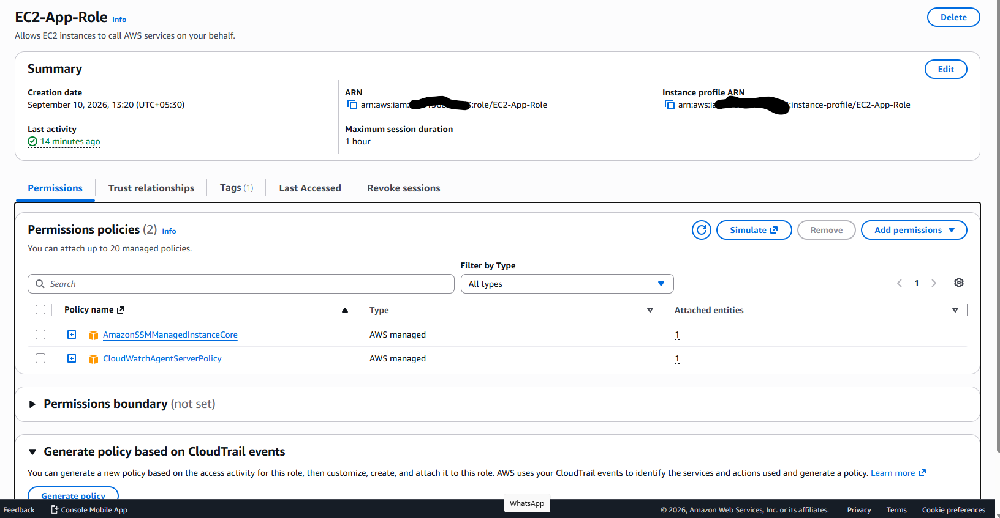

### 5. Launch Template

Since Auto Scaling launches from a template rather than a standalone instance, a Launch Template (`rs-app-server-LT`) was created with:

- AMI: Amazon Linux
- Instance type: `t3.micro`
- Security group: `EC2-SG`
- IAM instance profile: `EC2-App-Role`
- User data to install and start nginx on boot, serving a placeholder page

> `amazon-linux-extras` is specific to the Amazon Linux 2 AMI. On Amazon Linux 2023, use `dnf install nginx -y` (or `yum install nginx -y`, symlinked to dnf) instead — `amazon-linux-extras` doesn't exist on AL2023.

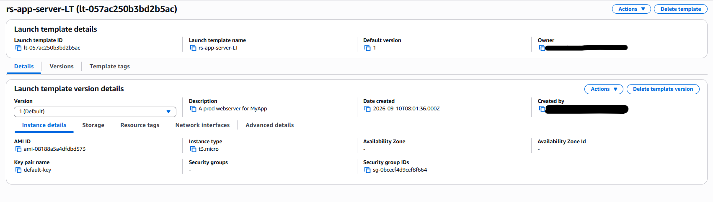

### 6. Target Group & Application Load Balancer

A **Target Group** (HTTP:80, health check on `/`) defines how the ALB determines instance health — this is what actually drives failover and scaling decisions, not just an assumption that instances are up.

The **Application Load Balancer** (`rs-alb-for-asg`) was deployed internet-facing across both public subnets, with:

- Listener HTTPS:443 → ACM certificate for `redsparrowenterprise.in` → forwards to the target group (TLS terminates here; traffic to targets stays plain HTTP since it never leaves the VPC)
- Listener HTTP:80 → **redirects** to HTTPS:443, so unencrypted requests are bounced rather than served

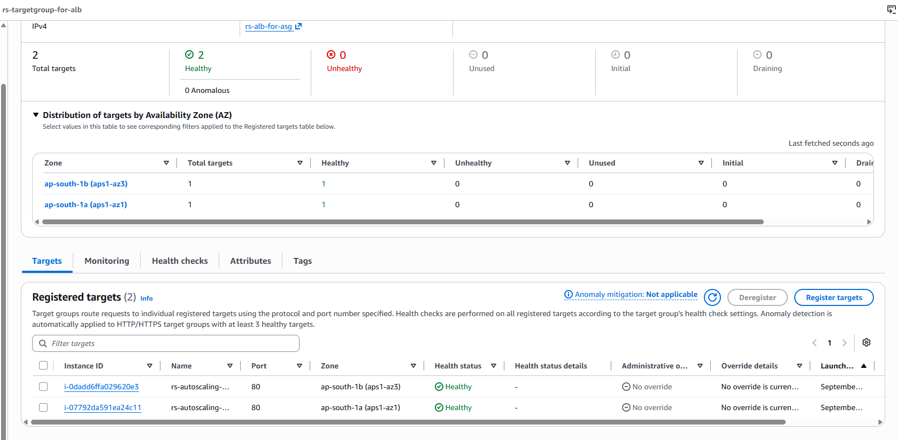
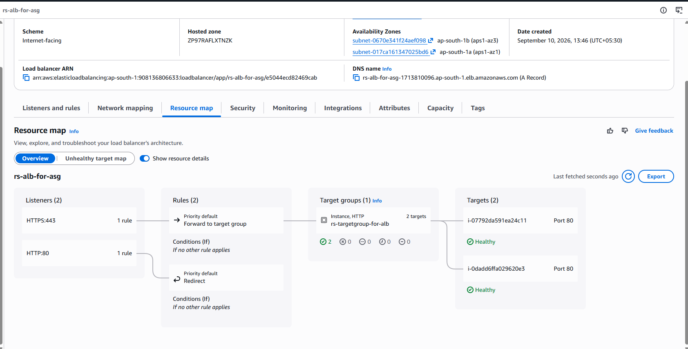

### 7. Route 53 — Custom Domain

An alias A record for `redsparrowenterprise.in` points at the ALB's DNS name, routing the custom domain straight to the load balancer.

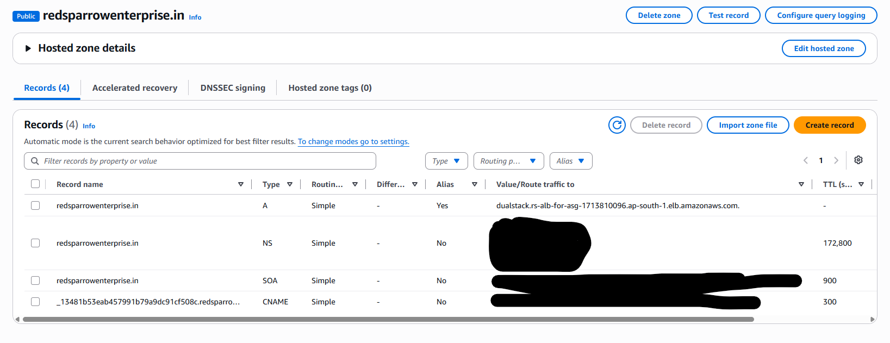

### 8. RDS MySQL (Multi-AZ, Private)

- **DB Subnet Group** created explicitly beforehand via RDS console → *Subnet groups*, selecting only the two private DB subnets (`Private-DB-1`, `Private-DB-2`) across both AZs.
  > The RDS wizard's inline "create new DB subnet group" option auto-selects subnets across the whole VPC without letting you choose which ones — it won't reliably stick to just the intended private subnets. Create the subnet group explicitly first, then select it from the wizard's dropdown.
- Engine: MySQL, `db.t4g.micro`
- VPC security group: `RDS-SG`
- Public access: **No**
- Multi-AZ deployment enabled for automatic failover
- Automated backups enabled with a defined retention period

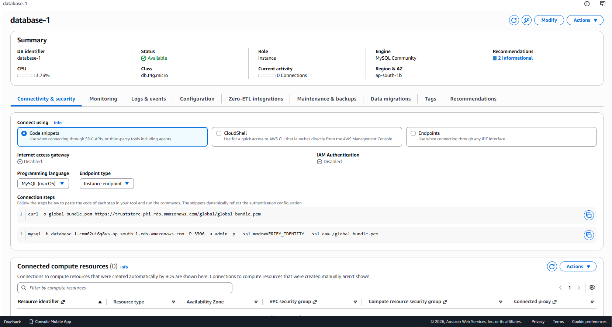
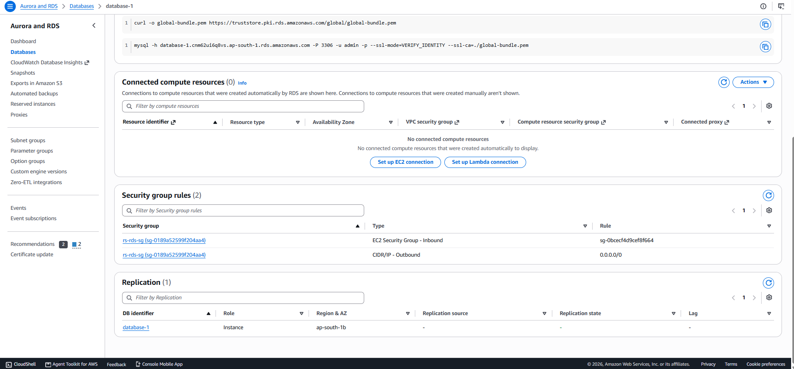

### 9. EC2 Auto Scaling Group

The ASG (`rs-autoscaling-group`) launches from the template in Step 5, spans both private app subnets, and is attached to the target group from Step 6:

- Min: 2, Max: 4, Desired: 2

**Scaling policy:** Min/Max alone don't make the group scale — a policy defines *when*. Added a **target-tracking policy** on Average CPU Utilization at 60%, so the group scales out when load rises and back in once it subsides, always within the Min/Max bounds.

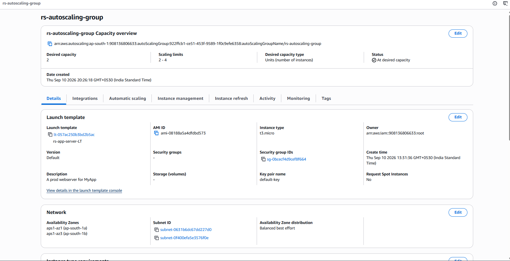
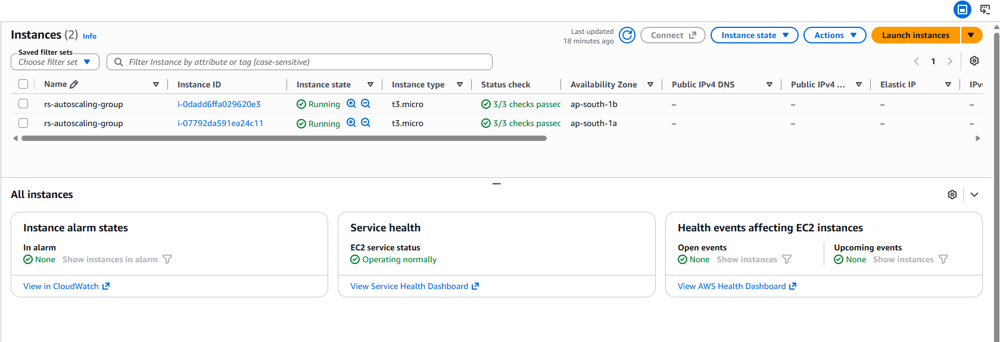

### 10. Monitoring & Alerting

Metrics alone don't notify anyone — they need to be wired to alarms and a notification channel:

- CloudWatch alarm: CPU Utilization > 80% for 5 minutes → notifies an SNS topic
- CloudWatch alarm: Unhealthy host count > 0 on the target group → notifies the same SNS topic
- SNS topic delivers email notifications on either alarm firing
- Detailed monitoring can be enabled on the launch template for 1-minute metric granularity instead of the default 5-minute

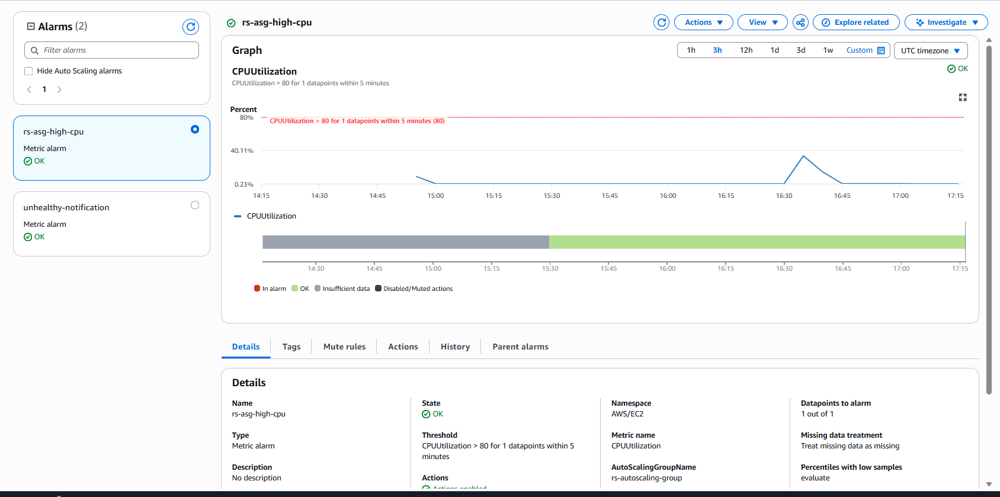

---

## Testing & Validation

- **HTTPS reachability + HTTP→HTTPS redirect** — verified the site loads over HTTPS and plain HTTP requests are redirected.
- **Load balancing across instances** — confirmed by watching the responding instance ID change across refreshes.
- **Health-check failover** — manually stopped nginx on one instance; confirmed the ALB rerouted traffic to the healthy instance and the CloudWatch alarm fired.
- **Auto Scaling under CPU load** — stress-tested the app tier to trigger scale-out, then verified automatic scale-in once load dropped.
- **RDS connectivity** — confirmed the security group rules with a manual DB client connection from the app tier.

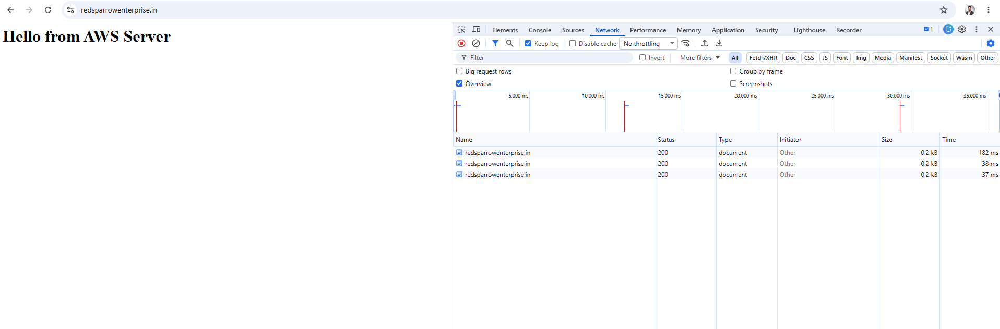

## Challenges & Fixes

Issues found and corrected while building this (full detail in [`docs/architecture-guide.md`](docs/architecture-guide.md)):

- **Missing NAT Gateway** — app servers in private subnets initially had no outbound internet path, which would have silently broken the nginx install script on first boot.
- **Missing RDS security group** — the original plan never scoped a security group specifically for the database.
- **Auto Scaling Group with no scaling policy** — Min/Max alone don't cause scaling; added a target-tracking policy on CPU.
- **DB subnet group gotcha** — creating it inline during RDS setup doesn't let you choose specific subnets; created it explicitly beforehand via the RDS console instead.

## Key Takeaways

- **Defaults are not safety nets.** An Auto Scaling Group with no scaling policy, or an RDS instance with no dedicated security group, will happily deploy without complaint — the gap only shows up under load or during an audit.
- **Private subnets need an explicit outbound path.** "Private" only means no direct inbound route; a NAT Gateway (or equivalent) is still required for outbound package installs and updates.
- **Health checks are what make an ALB useful.** Attaching instances to a load balancer without a defined target-group health check leaves the ALB with no way to know when to stop routing to a failed instance.
- **IAM roles remove the need for long-lived credentials.** SSM Session Manager plus a scoped instance role eliminates SSH keys and bastion hosts entirely, shrinking the attack surface.
- **Console-first, then code.** Building this manually first surfaced gaps (missing NAT Gateway, missing scaling policy) that would otherwise have shipped silently in a first-pass Terraform module.

## Security Notes

- No security group in this project allows unrestricted inbound access to the app or database tier — only the ALB is reachable from `0.0.0.0/0`.
- Instance access is via IAM + SSM Session Manager only; there are no SSH key pairs or bastion hosts in the path, and no long-lived credentials are stored on the instances.
- The database has no public accessibility and sits in a subnet with no route to the internet.
- TLS is terminated at the load balancer using an ACM-issued certificate; HTTP requests are redirected rather than served in plaintext.
- Database credentials are currently entered manually at RDS creation time — see [Future Improvements](#future-improvements) for migrating these to Secrets Manager, which is the recommended next step before treating this as production-ready.
- Screenshots in this repository have account IDs, ARNs, and DNS record values redacted where they could expose account-identifying information.

## Future Improvements

- Rebuild as Infrastructure as Code (Terraform/CloudFormation) for repeatability
- Add AWS WAF in front of the ALB
- Move DB credentials into Secrets Manager instead of manual entry
- CI/CD pipeline for app deployment

## License

This project is licensed under the MIT License — see [LICENSE](LICENSE) for details.
